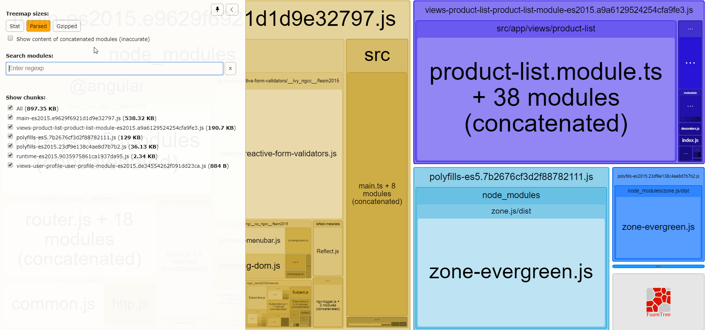

# angular-rxweb-cele

[Edit on StackBlitz ⚡️](https://stackblitz.com/edit/angular-rxweb-cele)

Project clone link: <https://github.com/duc-n/angular-rxweb-cele.git>

Shortcut html format : Shift+Alt+F

ng update @angular/cli @angular/core --allow-dirty --force

# Setup class-transformer : 
## **this dependency helps to create a class instance from a json object**
- npm install @rxweb/reactive-form-validators --save
- npm install class-transformer --save
- npm install reflect-metadata --save

## Configuration :
1. Add the RxReactiveFormsModule in app.module.ts
```js
@NgModule({
  imports: [
    BrowserModule,
    ReactiveFormsModule,
    RxReactiveFormsModule
    ...
```
2. Add import 'reflect-metadata' in main.ts :
```js
import 'reflect-metadata';
```
3. Message error config :
```js
export class AppComponent {
  constructor() {
    ReactiveFormConfig.set({
      validationMessage: {
        required: "This field is required.",
        minLenght: "Enter minimum length of {{0}} characters.",
        compare: "The value should be matched with {{0}}.",
        alpha: "You can only enter alphabets."
      }
    });
  }
}
```
# VSCode Extension : 
- Angular Extension Pack
- Beautify
- GitLens
- Markdown All in One 
> Shortcut preview in Markdown All in One: Ctrl + Shift + V


ReactiveFormConfig.autoInstancePush = true

# Install primeng :
- npm install primeng --save
- npm install primeicons --save
- npm install @angular/cdk --save
  
1. Open the angular.json and add the following in the styles section
```js
"./node_modules/primeicons/primeicons.css",
"./node_modules/primeng/resources/themes/nova-light/theme.css",
"./node_modules/primeng/resources/primeng.min.css",
```

# Measuring bundle sizes with Webpack bundle analyzer
1. Install Webpack bundle analyzer:
- npm i -g webpack-bundle-analyzer
  
2. To generate the result json file, run the command :
- npm run build -- --prod --named-chunks --stats-json

3. Use Webpack bundle analyzer as :
- webpack-bundle-analyzer dist/stats.json
- Open chrome and type : http://127.0.0.1:8888



# Typescript - Javascript syntax :
1. Operator ?? : return the first argument if it is not null/undefined, otherwise, it will return the second argument
 - null ?? 5 // => 5
 - 3 ?? 5 // => 3
```js
var currMoney = 0
function moneyAmount(money) {
  return money || `You currently do not own an account in the bank`
}
console.log(moneyAmount(currMoney)) // => `You currently do not own an account in the bank`

Correction :
var currMoney = 0
var noAccount = null

function moneyAmount(money) {
  return money ?? `You currently do not own an account in the bank`
}
 moneyAmount(currMoney) // => 0
 moneyAmount(noAccount) // => `You currently do not own an account in the bank`
```